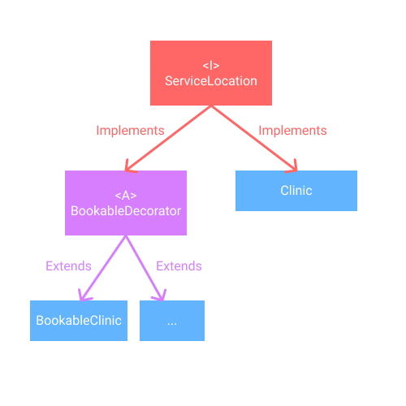

# Design Document Phase 2
## SOLID
Our program adheres to the SOLID design principles in the following ways:
### Single-Responsibility Principle
Multiple actions are done at different times to manipulate entities, notably clinics, appointments, and vaccination supplies. Our program strategically divides up these responsibilities into 6 core use cases:
* Concerning all clinics:
  * Adding a vaccine batch with an expiry, quantity, and brand to the clinic’s vaccine supply
  * Setting a clinic’s number of employees for a date and setting the number of time slots for desired time slot of the day
* Concerning appointment-based clinics:
  * Booking an appointment for the given client based off of the clinic, vaccine brand, and time period specified
  * Viewing an appointment’s details as a string by its appointment unique identifier provided by the user
  * Cancelling an appointment by its appointment unique identifier
  * Adding an appointment to a clinic's vaccination log by either a provided appointment ID or a provided date to log multiple

Splitting up our use cases as such ensures that responsibilities are divided into appropriate classes, whereby a change in one does not interfere with the performance of another.
### Open-Closed Principle
When dealing with appointment-based clinics, we decided to use the decorator design pattern to expand the functionality of clinics without modifying the core entity. Therefore our implementation is open to extension and closed to modification. In the future, if we wanted to add more decorators for added functionality to clinics, this would be very much possible.

As well, our database class structure, which also follows clean architecture, features many interfaces that allow us to easily create new controllers and drivers for storing and retrieving data. In fact, our program makes use of a mock database class called "ExampleRetrieval" that simulates the JSON data being passed into the system via an external source. This demonstrates the versatility of our program.

### Liskov Substitution Principle
Our program does not make much use out of subclasses except for in the decorators, where an abstract decorator class is used. Since this abstract class cannot be instantiated on its own, Liskov’s substitution principle does not apply. Otherwise, there is no need to apply this principle in our program.

### Interface Segregation Principle
Interfaces are used throughout the program to enforce functionality, such as through the ManagementSystem and UseCaseManagerInterface interfaces. These enforce any management systems or use case managers to have the core functionalities of such a program, such as booking an appointment or adding a batch to a clinic, regardless of the underlying implementations of these features. 

The classes involved in data storing and retrieving abide by this principle as well. Specifically, each database table has a corresponding interface associated with it, resulting in 5 interfaces whose behaviours are segregated from each other.

### Dependency Injection Principle
Interfaces in our program also allow us to add a layer of abstraction between the low-level and high-level classes. Specifically:
* ManagementSystem interface between the command line and the management system implementations
* UseCaseManagerInterface interface between the management system implementations and the use cases
* ServiceLocation interface between the use cases and the service location implementations, such as clinics
* ServiceLocationDecorator abstract class between the use cases and bookable clinics
* Multiple interfaces in the databaseintegration package, such as DataModification, DataRetrieval, and interfaces for each of the database tables

Thus, there are no strong dependencies between the different levels of architecture. In all cases, the abstraction layer allows us to decouple the system and subsequently follow the Open-Closed principle as well.

## Clean Architecture
Our program heavily follows the four-layered clean architecture model by separating our classes into the following distinctions:
1. Drivers, such as Command Line
2. Controllers, such as Vaccine Management System
3. Use Cases, such as Batch Adding, Time Period Adding, and Appointment Booking
4. Entities, such as Clinics, Appointments, Time Periods, and Vaccine Batches

Take the following scenario walkthrough for example:

 A given clinic receives a batch of 400 Pfizer vaccine doses and this batch must be logged into the clinic’s vaccine management system. Using the CommandLine, a clinic manager   inputs their clinic ID which cross references a list of valid clinic IDs. Once the Clinic is selected, the clinic manager indicates that they want to add a VaccineBatch to the Clinic’s VaccineSupply, using the BatchAdding class. They specify the batch ID (60), brand (Pfizer), the number of individual doses (400), and the expiry date for this VaccineBatch (e.g. 2 months from today). This sets off a chain of events that results in a new VaccineBatch being created for the given Clinic’s VaccineSupply.

Let’s decompose this into the two main actions which are called. Let the n-th layer of clean architecture (as specified above) be denoted as Ln:
| Description                                                                                                                                                                                                                                                                                                           | Workflow                                                                                                                                                                                                                                                                                                                                                                                                                                                                                                                                                                                              |
|-----------------------------------------------------------------------------------------------------------------------------------------------------------------------------------------------------------------------------------------------------------------------------------------------------------------------|-------------------------------------------------------------------------------------------------------------------------------------------------------------------------------------------------------------------------------------------------------------------------------------------------------------------------------------------------------------------------------------------------------------------------------------------------------------------------------------------------------------------------------------------------------------------------------------------------------|
| Using the CommandLine, a clinic manager inputs their clinic ID which cross references a list of valid clinic IDs                                                                                                                                                                                                      | CommandLine (L1) calls the ManagementSystem (Interface)’s getClinicIds method. This is implemented by VaccineManagementSystem (L2), which in turn calls its useCaseManagerInterface (Interface)’s getClinicIds method. This is implemented by UseCaseManager (L3), which stores and returns the list of clinic IDs. Once this list is returned to the outermost layer, CommandLine searches for the given ID in the list.                                                                                                                                                                             |
| Once the Clinic is selected, the clinic manager indicates that they want to add a VaccineBatch to the Clinic’s VaccineSupply, using the BatchAdding class. They specify the batch ID (60), brand (Pfizer), the number of individual doses (400), and the expiry date for this VaccineBatch (e.g. 2 months from today) | CommandLine (L1) calls the ManagementSystem (Interface)’s addBatch method. This is implemented by VaccineManagementSystem (L2), which in turn calls its useCaseManagerInterface (Interface)’s addBatch method. This is implemented by UseCaseManager (L3), which creates a new BatchAdding (L3) instance to complete the task for a given ServiceLocation (Interface). BatchAdding’s addBatch method is called, which calls the ServiceLocation’s getSupply method which is implemented by Clinic (L4). Then, Clinic’s VaccineSupply (L4) instance is retrieved and a VaccineBatch instance is added. |

As mentioned, dependency inversion is used extensively, thus preserving the clean architecture’s dependency requirement. In other words, the outer layers only depend on the inner layers and not the inverse, and each layer has interfaces that they implement for the outer layers to reference. This approach has the advantage of maintaining a clean, organized program and allowing for ease of collaboration.

- CRC-cards were uploaded within the folder `phase1` to demonstrate consistency with the Clean Architecture.

## Design Patterns
### Decorator
In our program, we chose to implement the Decorator design pattern. We made an interface called `ServiceLocation`, which supports methods for reading and writing vaccine and appointment details.

We have two classes, `Clinic` - which acts as our __core-functionality__ and `ClinicDecorator` - which acts as our __optional wrapper__ in the form of an abstract class, both which implement the ServiceLocation interface.

Furthermore, the `ClinicDecorator` class has one subclass describing _one option of decoration_: `BookableClinic` - for a clinic that accepts clients with booked appointments. And although our program currently allows for only one choice of decoration, according to how the Decorator Pattern is structured, future development of our code allows for further additions of new decorations, to represent new types of Clinics.

At this point we would like to note that what sets apart our core clinic from its decoration counterparts is that it is able to support staff and supply, but not appointment services - or in other words a clinic which would accept its clients without an explicit appointment booked through the system. Leaving these functionalities to the different decoration clinics.

To elaborate with some examples within our code, the __ServiceLocation__ contains methods such as `getVaccineLog()` -  which returns a list of all the previous vaccinations that have taken place - `getTimePeriods(...)` - which returns the time period of a clinic at a given time - and `getPastVaccinations(...)` - which logs a past vaccination event with a client, given the appropriate information. These three methods are then implemented in both __Clinic__, __ClinicDecorator__ and in turn in __BookableClinic__ as well - as it is a child of _ClinicDecorator_. However, while `getTimePeriods(...)` simply gets implemented within the classes, `getVaccineLog()` is overridden in __ClinicDecorator__, and `getPastVaccinations(...)` is overloaded in __BookableClinic__. Along with a freshly written method within __BookableClinic__ called `addAppointment(...)` - which adds an appointment to the system with the appropriate information.

Therefore, allowing access to: `getTimePeriods()` regardless of the clinic’s classification; `getVaccineLog(...)` and `getPastVaccinations(...)` where the inner details vary depending on the clinic type; and `addAppointment(...)` if the clinic is classified as a specific type - within the code these methods would be called where we know the object clinic is of that specific decoration form.

For future implementation of the code, we could use this pattern to expand further the code to accommodate managers of other types of clinics, allowing better access to clients with different preferences.

### Builder

For phase 2 we also decided to implement the builder design pattern for our entities that are constructed when our program is run. These classes include clinic, appointment and vaccine batch. We decided to do this based on the feedback from our TA that our constructors were too long and to add more flexibility when constructing these objects.

For each of these three classes, the builder is implemented as a static class within each of our entity classes. It allows us to pick and choose which instance attributes to build the object with and there are assert statements in place to assure that necessary instance attributes are not null.

For example, the entity clinic has six instance attributes (clinicId, supply, log, timePeriods, shifts and location). Of these six, only clinicId and location are required with the other four parameters being optional. The builder design pattern allows us to build a clinic with a location and clinicId as well as any combination of the optional parameters.

The builder design pattern is also implemented in the DatabaseRetrieval and DatabaseModification the same way it was implemented in the entities. We decided to use the builder pattern due to the length of the constructor. The Json package builder is also used to create Json objects. 

## Use of GitHub Features
For our project, we have been using many of the great features provided by GitHub to enhance the way we work as a group.
* Creating branches and using pull requests
  * Each group member has their own branches they use to make changes
  * Instead of committing to main, we push commits on branches and merge them into the project using pull requests
  * As of Phase 2, we have been using the review function on pull requests to request reviewers and leave reviews. 
* Actions and Issues
  * One member of our group has a Chromebook and cannot use IntelliJ when we meet up in person to work on the project. This means they make changes directly in GitHub and sometimes there are some errors in their commits. The actions tab on GitHub helps us review all the previous workflows and see what errors were made.
  * So far our group has used the issues tab to bring up any issues we have with the design of our project. Some examples can be seen below.
    * Reworking the hierarchy of clinics and bookable clinics
    * Reworking the hierarchy of the use cases and their interaction with VaccineManagement

## Code Style and Documentation
For this project we have been documenting all the code we are writing as well as reviewing the pull requests group members make and adjusting style errors
* Comments
  * At the top of each class, we have a doc string that explains what the class is and a summary of what it contains (instance attributes).
  * For each method in a class, we have a one line comment that explains what the method does right above it. For more complicated methods, there are inline comments that explain more complex pieces of code. 
* Style Warnings
  * We have been fixing the style warnings highlighted in IntelliJ as they come up after the feedback we got for Phase 0
* Reviewing Pull Requests
  * For phase 0 we did not really spend the time to properly review pull requests
  * For phase 1 we have been properly reviewing pull request on the following criteria
    * Any errors in the code
    * Documentation and comments
    * Making sure methods and classes are implemented in a way that matches our design speciation/class diagram
  * For Phase 2 we have still been reviewing pull requests in a thorough manner
* JavaDocs
  * For Phase 2 we have added JavaDocs to all of our methods in all of our classes 
## Testing 
The goal of our project is to extensively test all the more complicated methods in our program. We will avoid testing for methods like getters, setters and simple boolean methods as these are simple in their implementation.
* Testing Schematics
  * Entities
    * We have test files for the more complicated methods in the entities
  * Use Cases
    * Testing all methods in our use cases
  * Database
    * Testing is implemented for storing and loading data from tables.
TODO: Add more information on database testing
## Refactoring 
So far we have implemented refactoring in many parts of our project, from renaming all the way to implementing a design pattern.
* Renaming
  * Make variable names clearer and easier to understand
  * Refactoring to make the interaction between classes clearer
* Refactoring Methods
  * For some classes there was only one method  that used a getter, so sometimes a separate getter method was not created. To make the code clearer and more cohesive, we used the IntelliJ refactor method feature to create a new method. 
* Refactoring Command Line
  * Originally, CommandLine was contained all in one class, but now it is split up into CommandLine and DataValidation, which stores the static methods and commands that CommandLine references.
  * CommandLine was a code smell (Bloaters)
  * With more time, CommandLine could be further cleaned by refactoring commonalities between use-case workflows into extracted functions which these use-case-specific functions call. As well, the large if-else block and the getValue function are most likely not implemented in a best-practice way and should be improved upon for phase 2.
* Refactoring to implement the decorator design
  * We changed our implementation of service location, clinic and bookable clinic by using the decorator design pattern (see above).
* Refactoring to implment the builder design pattern
  *   We changed the implementation of the constructors of three entities (VaccineBatch, Clinic and Appointment) to the builder design pattern (see above).

## Code Organization
Our code was organized in accordance with clean architecture, that is, each package in the ‘main’ file represents a layer of clean architecture, with the exception of the ‘Use Cases’ and ‘Drivers’ layers.

Instead of isolating the ‘Use Cases’ layer, we decided to separate it into the two main functions of our program: clientbooking - which contains the classes involved in the booking of appointments, and clinicmanagement- which contains the classes needed to manage the clinic. 

On the other hand, the ‘Drivers’ layer is where the CommandLine is created and where our Main class is located. For the time being, we have decided to separate the database from the ‘Drivers’ package until we have got it connected. 

Our ‘Managers’ layer contains the interfaces and the management systems that manage the Use Cases (from layer below) and is used by the Command Line (in layer above).  

As its name implies, the ‘Entities’ layer contains all the entities of this program.

Lastly, we have a package called ‘constants’ which contains the constants related to the booking process, including entity-specific constants and driver constants, as well as a custom exception class that contains the constants for error messages thrown by the use cases.

Organizing our code using this package structure made it easy to abide by clean architecture. It also made it easy to understand what part of the program collaborated with what (for instance, the Use Cases AppointmentBooking, AppointmentCancellation, and AppointmentViewing are all in the clientbooking package. All three classes have to do with the client’s appointment. An example of the classes relying on each other is the fact that you can’t cancel an appointment that you haven’t booked, which requires AppointmentBooking and AppointmentCancellation).

Furthermore, as was mentioned above, we have implemented the Decorator design pattern. This way we have optimized the organization of the code involved with clinics, and their subtypes. When designing our code, we’ve been using the “camelCase” format for variables and method names and ‘PascalCase’ for class names. This distinguishing between variable names and method names makes things clearer when creating a new variable which we name the same thing as the object type.

Lastly, our ‘test’ file contains the tests for this program, and is named with the name of the class, followed by Test. These tests are not only for entities, but for the database and use cases as well.

## Functionality
For the most part, our program does what we mentioned in the design document in Phase 1. The main area of focus for phase 2 was to expand upon our use of a cloud hosted MySQL database.

Before, there was no functionality other than establishing a connection to the database and manually inputting data. Now the database is integrated with our program and the functionality has increased massively. Our program now loads the data from the database whenever it is run, meaning that data from past sessions carry over to future sessions. We know also have the ability to store objects in the database like Appointments, Time Periods and Vaccine Batches. 

As of right now, our program does not have the ability to add clients and clinics to the database. We decided to implement the program this way because we are assuming that in practice the system will have access to a government database of all eligible clients for vaccination (Only eligible clients can book an appointment). Also, the clinics that provide vaccinations must be approved by the government, so the clinics will be based on the list of government approved clinics.

TODo: Add more

